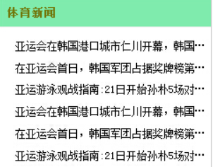
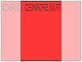

## 1、CSS3 简介

#### 1.1 css3

CSS3 是 CSS 规范的最新版本，在 CSS2.1 的基础上增加了很多强大的新功能，以帮助开发人员解决一些实际面临的问题。例如，CSS3 支持圆角、多背景、透明度、阴影、动画等功能 

####1.2 浏览器支持

[查兼容性传送门](https://www.caniuse.com/)

​       CSS有各种各样的版本，不同的浏览器对CSS的不同版本支持并不一致，所以知道要使用哪个版本的CSS是很重要的,W3C的CSS3规范仍在开发。但是，许多新的CSS3属性已在现代浏览器使用。

​       紧跟着CSS3，新的CSS4也即将问世，它正由W3C编辑团队研发中。从历史的角度看，CSS的发展和web浏览器的发展是相互独立的，它们是并行进步的。这就导致不同的浏览器支持不同的CSS规范。

​        下面的图表列出了 IE，Chrome，Firefox， Safari，Opera 五大主流浏览器，在 Mac 和 Windows 两个平台，对 HTML5 和 CSS3 各种特性最新的支持情况的详细清单（个别数据可能不准确，大家可以通过 caniuse.com 查询更为详细的信息）。


​        CSS3 选择器兼容情况最让人欣慰，除了 IE9 以下的版本，其它浏览器已全部支持 **CSS3** 选择器特性。IE6 悲剧的一个都不支持，IE7 和 IE8 仅支持少部分，IE9 和 IE10 给力，竟然也全部支持。


#### 1.3 使用 CSS3的好处

**1．减少开发与维护成本**

​	先来看一个实例。一个圆角效果，在 CSS 中需要添加额外的 HTML 标签，使用一个或者更多图片来完成，而使用 CSS3 只需要一个 标签、一个border-radius 属性就能完成。这样，CSS3 技术能把你从绘图、切图和优化图片 的工作中解救出来。

​	最后，有些 CSS3 技术还能帮你对页面进行“减肥”，让结构更加“苗条”。例如，制作一个重叠的背景效果，在 CSS 中需要添加 DIV 标签和类名，在不同 的 DIV 中放一张背景图，现在可以使用 CSS3 的多背景和背景尺寸等新特性，在一个 DIV 标签中完成这些工作。

**2．提高页面性能**

很多 CSS3 技术通过提供相同的视觉效果而成为图片的“替代品”，换句话说，在进行 Web 开发时，减少多余的标签嵌套，以及图片的使用数量，意味着用户要下载的内容将会 更少，页面加载也会更快。


## 2、CSS3 选择器

根据所获取页面中元素的不同，把 CSS3 选择器分为五大类：基本选择器、层次选择 器（兄弟、后代、子代）、伪类选择器、伪元素和属性选择器（E[attr]）。

其中，伪类选择器又分为六种：动态伪类选择器（锚状态/input框/）、 目标伪类选择器(E:target)、语言伪类(E:lang)、UI 元素状态伪类选择器(checked/enabled/disabled)，结构伪类选择器（类型伪类/子节点伪类）和否定伪类选择器（E:not(s)）， 如下图所示。


## 3、CSS3 属性


#### **3.1 边框**

用 CSS3，你可以创建圆角边框，添加阴影框

- border-radius
- box-shadow：盒子阴影 ：3px 3px 3px  #000
- border-image


**CSS3 边界图片**


有了 CSS3 的 border-image 属性，你可以使用图像创建一个边框（使用条件，与border-style合用）：


- repeat:将图片以平铺的方式进行显示
- stretch:将图像以拉伸的方式进行显示
- round:讲图像进行平铺显示，但是如果最后一幅图不能被完全显示时，就不显示图像，将之前的图像扩大。


```css
div{
				width: 200px;
				height: 200px;
				border:30px solid transparent;
				border-image: url(01.png) 100 repeat;
			}
```


#### 3.2 渐变

CSS3 渐变（gradients）可以让你在两个或多个指定的颜色之间显示平稳的过渡。

以前，你必须使用图像来实现这些效果。但是，通过使用 CSS3 渐变（gradients），你可以减少下载的事件和宽带的使用。此外，渐变效果的元素在放大时看起来效果更好，因为渐变（gradient）是由浏览器生成的。

CSS3 定义了两种类型的渐变（gradients）：

- **线性渐变（Linear Gradients）- 向下/向上/向左/向右/对角方向**
- **径向渐变（Radial Gradients）- 由它们的中心定义**

为支持更多的浏览器版本，样式属性前需加-webkit-、-moz- 或 -o-的前缀。


#####3.2.1 线性渐变

1. 基本使用
2. 多颜色
3. 渐变方向（to left,to right,to right bottom等）
4. 使用角度（0deg）
5. 颜色分布
6. 透明度
7. 重复渐变：repeating-linear-gradient

为了创建一个线性渐变，你必须至少定义两种颜色结点。颜色结点即你想要呈现平稳过渡的颜色。同时，你也可以设置一个起点和一个方向（或一个角度）。

语法：

```
background: linear-gradient(direction, color-stop1, color-stop2, ...);
```

direction可选值有：to bottom、to top、to right、to left、to bottom right等等。

也可以是角度


- 线性渐变 - 从上到下（默认情况下）

下面的实例演示了从顶部开始的线性渐变。起点是红色，慢慢过渡到蓝色：

```
#grad1 {
    height: 200px;
    background: -webkit-linear-gradient(red, blue); /* Safari 5.1 - 6.0 */
    background: -o-linear-gradient(red, blue); /* Opera 11.1 - 12.0 */
    background: -moz-linear-gradient(red, blue); /* Firefox 3.6 - 15 */
    background: linear-gradient(red, blue); /* 标准的语法（必须放在最后） */
}
```


- 线性渐变 - 从左到右

下面的实例演示了从左边开始的线性渐变。起点是红色，慢慢过渡到蓝色：

```
#grad1 {
    height: 200px;
    background: -webkit-linear-gradient(left, red , blue); /* Safari 5.1 - 6.0 */
    background: -o-linear-gradient(right, red, blue); /* Opera 11.1 - 12.0 */
    background: -moz-linear-gradient(right, red, blue); /* Firefox 3.6 - 15 */
    background: linear-gradient(to right, red , blue); /* 标准的语法（必须放在最后） */
}
```

- 线性渐变 - 对角

你可以通过指定水平和垂直的起始位置来制作一个对角渐变。

下面的实例演示了从左上角开始（到右下角）的线性渐变。起点是红色，慢慢过渡到蓝色：

```
#grad1 {
    height: 200px;
    background: -webkit-linear-gradient(left top, red , blue); /* Safari 5.1 - 6.0 */
    background: -o-linear-gradient(bottom right, red, blue); /* Opera 11.1 - 12.0 */
    background: -moz-linear-gradient(bottom right, red, blue); /* Firefox 3.6 - 15 */
    background: linear-gradient(to bottom right, red , blue); /* 标准的语法（必须放在最后） */
}
```


###### **使用角度-线性渐变**

如果你想要在渐变的方向上做更多的控制，你可以定义一个角度，而不用预定义方向。

语法：

```
background: linear-gradient(angle, color-stop1, color-stop2);
```

角度是指 y轴线（数学中的Y轴） 和渐变线之间的角度，顺时针方向计算。换句话说，0deg 将创建一个从下到上的渐变，90deg 将创建一个从左到右的渐变。


```
#grad1 {
    height: 100px;
    background: -webkit-linear-gradient(0deg, red, blue); /* Safari 5.1 - 6.0 */
    background: -o-linear-gradient(0deg, red, blue); /* Opera 11.1 - 12.0 */
    background: -moz-linear-gradient(0deg, red, blue); /* Firefox 3.6 - 15 */
    background: linear-gradient(0deg, red, blue); /* 标准的语法（必须放在最后） */
}

#grad2 {
    height: 100px;
    background: -webkit-linear-gradient(90deg, red, blue); /* Safari 5.1 - 6.0 */
    background: -o-linear-gradient(90deg, red, blue); /* Opera 11.1 - 12.0 */
    background: -moz-linear-gradient(90deg, red, blue); /* Firefox 3.6 - 15 */
    background: linear-gradient(90deg, red, blue); /* 标准的语法（必须放在最后） */
}

#grad3 {
    height: 100px;
    background: -webkit-linear-gradient(180deg, red, blue); /* Safari 5.1 - 6.0 */
    background: -o-linear-gradient(180deg, red, blue); /* Opera 11.1 - 12.0 */
    background: -moz-linear-gradient(180deg, red, blue); /* Firefox 3.6 - 15 */
    background: linear-gradient(180deg, red, blue); /* 标准的语法（必须放在最后） */
}

#grad4 {
    height: 100px;
    background: -webkit-linear-gradient(-90deg, red, blue); /* Safari 5.1 - 6.0 */
    background: -o-linear-gradient(-90deg, red, blue); /* Opera 11.1 - 12.0 */
    background: -moz-linear-gradient(-90deg, red, blue); /* Firefox 3.6 - 15 */
    background: linear-gradient(-90deg, red, blue); /* 标准的语法（必须放在最后） */
}
```


###### **使用多个颜色节点**

```css
/*3 个颜色结点（未指定百分比时颜色均匀分布）*/
#grad1 {
    height: 200px;
    background: -webkit-linear-gradient(red, green, blue); /* Safari 5.1 - 6.0 */
    background: -o-linear-gradient(red, green, blue); /* Opera 11.1 - 12.0 */
    background: -moz-linear-gradient(red, green, blue); /* Firefox 3.6 - 15 */
    background: linear-gradient(red, green, blue); /* 标准的语法（必须放在最后） */
}
/*3 个颜色结点（不均匀分布）*/
/* 前面10%是纯红色，10%到45%是红到绿的渐变，45%-70%是绿到蓝的渐变 最后30%是纯蓝色 */
#grad3 {
    height: 200px;
    background: -webkit-linear-gradient(red 10%, green 45%, blue 70%); /* Safari 5.1 - 6.0 */
    background: -o-linear-gradient(red 10%, green 45%, blue 70%); /* Opera 11.1 - 12.0 */
    background: -moz-linear-gradient(red 10%, green 45%, blue 70%); /* Firefox 3.6 - 15 */
    background: linear-gradient(red 10%, green 45%, blue 70%); /* 标准的语法（必须放在最后） */
}
```

练习案例：

练习一


###### **使用透明度（transparent）**

CSS3 渐变也支持透明度（transparent），可用于创建减弱变淡的效果。

为了添加透明度，我们使用 rgba() 函数来定义颜色结点。rgba() 函数中的最后一个参数可以是从 0 到 1 的值，它定义了颜色的透明度：0 表示完全透明，1 表示完全不透明。

下面的实例演示了从左边开始的线性渐变。起点是完全透明，慢慢过渡到完全不透明的红色：


```css
#grad1 {
    height: 200px;
    background: -webkit-linear-gradient(left, rgba(255,0,0,0), rgba(255,0,0,1));
    /* Safari 5.1 - 6.0 */
    background: -o-linear-gradient(right, rgba(255,0,0,0), rgba(255,0,0,1)); 
    /* Opera 11.1 - 12.0 */
    background: -moz-linear-gradient(right, rgba(255,0,0,0), rgba(255,0,0,1));
    /* Firefox 3.6 - 15 */
    background: linear-gradient(to right, rgba(255,0,0,0), rgba(255,0,0,1));
    /* 标准的语法（必须放在最后） */
}
```


###### **重复的线性渐变**

repeating-linear-gradient() 函数用于重复线性渐变：


```css
#grad1 {
    height: 200px;
    background: -webkit-repeating-linear-gradient(red, yellow 10%, green 20%); 
    /* Safari 5.1 - 6.0 */
    background: -o-repeating-linear-gradient(red, yellow 10%, green 20%); 
    /* Opera 11.1 - 12.0 */
    background: -moz-repeating-linear-gradient(red, yellow 10%, green 20%); 
    /* Firefox 3.6 - 15 */
    /*渐变地方很少，就只有10%，可以用repeating-linear-gradient来重复渐变*/
    background: repeating-linear-gradient(red, yellow 10%, green 20%); 
    /* 标准的语法（必须放在最后） */
}
```


##### 3.2.2 径向渐变

径向渐变由它的中心定义。

为了创建一个径向渐变，你也必须至少定义两种颜色结点。颜色结点即你想要呈现平稳过渡的颜色。同时，你也可以指定渐变的中心、形状（原型或椭圆形）、大小。默认情况下，渐变的中心是 center（表示在中心点），渐变的形状是 ellipse（表示椭圆形），渐变的大小是 farthest-corner（表示到最远的角落）。

语法：

```css
background: radial-gradient(center, shape size, start-color-stop1, ..., last-color-stop2);
```

渐变中心可选值：center（中心点，相当于“50% 50%”），可用百分比

渐变形状shape 可选值：circle 表示圆形，ellipse 表示椭圆形

渐变大小size 可选值： farthest-corner（表示到最远的角落），closest-corner、farthest-side、closest-side


###### **径向渐变 - 颜色结点均匀分布（默认情况下）**


```css
#grad1 {
    height: 150px;
    width: 200px;
    background: -webkit-radial-gradient(red, green, blue); /* Safari 5.1 - 6.0 */
    background: -o-radial-gradient(red, green, blue); /* Opera 11.6 - 12.0 */
    background: -moz-radial-gradient(red, green, blue); /* Firefox 3.6 - 15 */
    background: radial-gradient(red, green, blue); /* 标准的语法（必须放在最后） */
}
```


###### **径向渐变 - 颜色结点不均匀分布**


```css
#grad1 {
    height: 150px;
    width: 200px;
    background: -webkit-radial-gradient(red 5%, green 15%, blue 60%); /* Safari 5.1 - 6.0 */
    background: -o-radial-gradient(red 5%, green 15%, blue 60%); /* Opera 11.6 - 12.0 */
    background: -moz-radial-gradient(red 5%, green 15%, blue 60%); /* Firefox 3.6 - 15 */
    background: radial-gradient(red 5%, green 15%, blue 60%); /* 标准的语法（必须放在最后） */
}
```


###### **设置形状**

shape 参数定义了形状。它可以是值 circle（圆） 或 ellipse（椭圆），默认值为椭圆。 。

```css
#grad {
  background: -webkit-radial-gradient(circle, red, yellow, green); /* Safari 5.1 - 6.0 */
  background: -o-radial-gradient(circle, red, yellow, green); /* Opera 11.6 - 12.0 */
  background: -moz-radial-gradient(circle, red, yellow, green); /* Firefox 3.6 - 15 */
  background: radial-gradient(circle, red, yellow, green); /* 标准的语法 */
}
```

###### **不同尺寸大小与位置的使用**

size 参数定义了渐变的大小。它可以是以下四个值：closest-side、farthest-side、closest-corner、farthest-corner。

> 注意：带前缀和不带前缀用法不一样
>
> - 不带前缀：第一个参数的格式是“渐变大小 at 渐变圆心坐标” 
>
>     background: radial-gradient(30px 100px at 50% 20%,blue,green,yellow,black);这句话表示 渐变的大小是宽30px ，高为100px,圆心位置是距离左边50%，距离上边20%
>
>    background: radial-gradient( closest-side at 50% 20%,blue,green,yellow,black); 表示圆心位置距离左边50%，距离上边20%，渐变大小是圆心到最近的边

第一个参数的格式是“渐变大小 at 渐变圆心坐标” 

| 常量              | 描述                                                         |
| ----------------- | ------------------------------------------------------------ |
| `closest-side`    | 渐变的边缘形状与容器距离渐变中心点最近的一边相切（圆形）或者至少与距离渐变中心点最近的垂直和水平边相切（椭圆）。就是最近的一条边 |
| `closest-corner`  | 渐变的边缘形状与容器距离渐变中心点最近的一个角相交。最近的一个角 |
| `farthest-side`   | 与closest-side相反，边缘形状与容器距离渐变中心点最远的一边相切（或最远的垂直和水平边）。最远的一条边 |
| `farthest-corner` | 渐变的边缘形状与容器距离渐变中心点最远的一个角相交。最远的一个角 |

```css
#grad1 {
  /* Safari 5.1 - 6.0 */
  background: -webkit-radial-gradient(60% 55%, closest-side,blue,green,yellow,black);
  /* Opera 11.6 - 12.0 */
  background: -o-radial-gradient(60% 55%, closest-side,blue,green,yellow,black);
  /* Firefox 3.6 - 15 */
  background: -moz-radial-gradient(60% 55%, closest-side,blue,green,yellow,black);
  /* 标准的语法 */
  background: radial-gradient( closest-sideat at 60% 55%,blue,green,yellow,black);
}

#grad2 {
  /* Safari 5.1 - 6.0 */
  background: -webkit-radial-gradient(60% 55%, farthest-side,blue,green,yellow,black);
  /* Opera 11.6 - 12.0 */
  background: -o-radial-gradient(60% 55%, farthest-side,blue,green,yellow,black);
  /* Firefox 3.6 - 15 */
  background: -moz-radial-gradient(60% 55%, farthest-side,blue,green,yellow,black);
  /* 标准的语法 */
  background: radial-gradient(farthest-side at 60% 55%,blue,green,yellow,black);
}
```


**重复的径向渐变**

repeating-radial-gradient() 函数用于重复径向渐变：

```css
#grad {
  /* Safari 5.1 - 6.0 */
  background: -webkit-repeating-radial-gradient(red, yellow 10%, green 15%);
  /* Opera 11.6 - 12.0 */
  background: -o-repeating-radial-gradient(red, yellow 10%, green 15%);
  /* Firefox 3.6 - 15 */
  background: -moz-repeating-radial-gradient(red, yellow 10%, green 15%);
  /* 标准的语法 */
  background: repeating-radial-gradient(red, yellow 10%, green 15%);
}
```


#### 3.3 文本效果

CSS3中包含几个新的文本特征。

本节课了解以下文本属性：

- text-shadow
- box-shadow
- text-overflow:**定义内联内容溢出其块容器是否截断或者添加(...)**
- word-break

**文本溢出**

CSS3文本溢出属性指定应向用户如何显示溢出内容...




用法

```css
overflow: hidden;
text-overflow: ellipsis;
white-space: nowrap;
```

实例：

```html
/*css样式规则*/
div.test
{
	white-space:nowrap; /*强制文本不换行*/
	width:50px; 
	overflow:hidden; /*溢出隐藏*/
	border:1px solid #000000;
	text-overflow:ellipsis;/*溢出段末显示省略号“...”*/
    text-overflow:clip;/*溢出段末截断*/
}

<!--html文本-->
<div class="test">This is some long text that will not fit in the box</div>
```


word-break**单词拆分换行**

换行规则：

```css
/*css样式规则*/
p.test1
{
	width:9em; 
	border:1px solid #000000;
	word-break:keep-all;
}
/*管你是incomprehensibilities这样一行都显示不下的单词，还是long这样很短的单词，只要碰到边界，都会被强制拆分换行。所以用word-break:break-all时要慎重呀。*/
p.test2
{
	width:9em; 
	border:1px solid #000000;
	word-break:break-all;
}

<!--html文本-->
<p class="test1"> This paragraph contains some text. This line will-break-at-hyphenates.</p>
<p class="test2"> This paragraph contains some text: The lines will break at any character.</p>
```


#### 3.4 字体


**@font-face 规则** 

以前CSS3的版本，网页设计师不得不使用用户计算机上已经安装的字体。使用CSS3，网页设计师可以使用他/她喜欢的任何字体。当你发现您要使用的字体文件时，只需简单的将字体文件包含在网站中，它会自动下载给需要的用户。

如果你的项目中是**英文网站**，而且项目中的Logo，Tags等应用到较多的这种特殊字体效果，我建议你不要使用图片效果，而使用@font-face，但是你是中文网站，我觉得还是使用图片比较合适，因为加载英文字体和图片没有多大区别，但是你加载中文字体，那就不一样了，因为中文字体太大了，这样会影响到项目的某些性能的优化；

**一、TureTpe(.ttf)格式：**

.ttf字体是Windows和Mac的最常见的字体，是一种RAW格式，因此他不为网站优化,支持这种字体的浏览器有【IE9+,Firefox3.5+,Chrome4+,Safari3+,Opera10+,iOS Mobile Safari4.2+】；

**二、OpenType(.otf)格式：**

.otf字体被认为是一种原始的字体格式，其内置在TureType的基础上，所以也提供了更多的功能,支持这种字体的浏览器有【Firefox3.5+,Chrome4.0+,Safari3.1+,Opera10.0+,iOS Mobile Safari4.2+】；

**三、Web Open Font Format(.woff)格式：**

.woff字体是Web字体中最佳格式，他是一个开放的TrueType/OpenType的压缩版本，同时也支持元数据包的分离,支持这种字体的浏览器有【IE9+,Firefox3.5+,Chrome6+,Safari3.6+,Opera11.1+】；

**四、Embedded Open Type(.eot)格式：**

.eot字体是IE专用字体，可以从TrueType创建此格式字体,支持这种字体的浏览器有【IE4+】；

**五、SVG(.svg)格式：**

.svg字体是基于SVG字体渲染的一种格式,支持这种字体的浏览器有【Chrome4+,Safari3.1+,Opera10.0+,iOS Mobile Safari3.2+】。

这就意味着在@font-face中我们至少需要.woff,.eot两种格式字体，甚至还需要.svg等字体达到更多种浏览版本的支持。

##### 1.找到这个字体的ttf格式，再用字体转换工具转换成不同的格式 

https://www.dafont.com/

http://www.foundertype.com/

**2.常见的字体格式转换工具有：FontsQuirrel、onlinefontconverter（个人比较喜欢用这个）。**

[FontsQuirrel](https://www.fontsquirrel.com/tools/webfont-generator) 

进入这个网址上传你下载的ttf字体，然后到这个界面


!1553408175232](assets/1553408175232.png)


3. 下载后有一个文件夹，字体文件放在项目里面，新建一个文件夹fonts来放字体文件


```css
	/*stylesheet.css*/
	@font-face {
		    font-family:myfont;
		    src: url('fonts/webfont.eot');
		    src: url('fonts/webfont.eot?#iefix') format('embedded-opentype'),
		         url('fonts/webfont.woff2') format('woff2'),
		         url('fonts/webfont.woff') format('woff'),
		         url('fonts/webfont.svg#benmo_youyuanregular') format('svg');
			    font-weight: normal;
			    font-style: normal;
		
		}
```

引用字体

```css
div {
			font-family: myfont;
		}
```


#### 3.5 2D转换

CSS3转换，我们可以通过transform属性让某个元素改变形状、大小和位置，我们可以移动，比例化，反过来，旋转，和拉伸元素。


本节课将了解2D变换方法：

- translate()
- rotate()
- scale()
- skew()

  

**平移 translate()方法**

translate()方法，根据左(X轴)和顶部(Y轴)位置给定的参数，从当前元素位置移动。**可以是负值**

（1）translateX(x)：元素仅在水平方向移动（X轴移动；

（2）translateY(y)：元素仅在垂直方向移动（Y轴移动）；

（3）transklate(x,y)：元素在水平方向和垂直方向同时移动（X轴和Y轴同时移动）；


```css
div#div2
{
	     transform: translate(100px,100px);
		-webkit-transform: translate(100px,100px);  /*safari chrome*/
		-moz-transform: translate(100px,100px);   /*火狐*/
		-o-transform: translate(100px,100px); /*oprea*/
		-ms-transform: translate(100px,100px); /*ie9*/
}
```


**旋转 rotate() 方法**

rotate()方法，在一个给定度数顺时针旋转的元素。负值是允许的，这样是元素逆时针旋转。单位是deg


```
div { transform: rotate(30deg); -ms-transform: rotate(30deg); /* IE 9 */ -webkit-transform: rotate(30deg); /* Safari and Chrome */ }
```


**放大缩小 scale() 方法  **


scale（2,3）转变宽度为原来的大小的2倍，和其原始大小3倍的高度。

```
div{ -ms-transform:scale(2,3); /* IE 9 */ -webkit-transform: scale(2,3); /* Safari */ transform: scale(2,3); /* 标准语法 */ }
```


**倾斜 skew() 方法 **

语法：

```
transform:skew(<angleX> [,<angleY>]);
```

包含两个参数值，分别表示X轴和Y轴倾斜的角度，如果第二个参数为空，则默认为0，参数为负表示向相反方向倾斜。

- skewX(<angle>);表示只在X轴(水平方向)倾斜。
- skewY(<angle>);表示只在Y轴(垂直方向)倾斜。

示例：

skew(30deg,20deg) 元素在X轴（从右向左）和Y轴（从下往上）上倾斜20度30度。

```
div { transform: skew(30deg,20deg); -ms-transform: skew(30deg,20deg); /* IE 9 */ -webkit-transform: skew(30deg,20deg); /* Safari and Chrome */ }
```


####3.6 3D转换

perspective ：

- 透视原理： **近大远小** 。

本节课将学到一些 3D 转换方法：

- rotateX()
- rotateY()


**rotateX() 方法** 

围绕其在一个给定度数X轴旋转的元素（从下往上）。示例：


```
div { transform: rotateX(120deg); -webkit-transform: rotateX(120deg); /* Safari 与 Chrome */ }
```


**rotateY() 方法**

围绕其在一个给定度数Y轴旋转的元素。（从右往左转）。示例：




```
div { transform: rotateY(130deg); -webkit-transform: rotateY(130deg); /* Safari 与 Chrome */ }
```


#### 3.7 过渡

CSS3 过渡是元素从一种样式逐渐改变为另一种的效果。

**transition 包括以下属性：** 

- `transition-property: all;` 如果希望所有的属性都发生过渡，就使用all。 
- `transition-duration: 1s;` 过渡的持续时间。 -

-  `transition-timing-function` 运动曲线。属性值可以是：

  - `linear` 线性

  - `ease` 减速

  - `ease-in` 加速

  - `ease-out` 减速

  - `ease-in-out` 先加速后减速

  - ```css
    /*例如*/
    transition-timing-function: linear;
    ```

- `transition-delay: 1s;` 过渡延迟。多长时间后再执行这个过渡动画。 

> 一般都是连写，很少单独把每个属性列出来：     transition: all 3s linear 0s; 
>
> 最常用的是： transition: all 3s ；

示例：应用于宽度属性的过渡效果，时长为 2 秒

```css
div { 
width:100px;
height:100px;
background-color: gray;
transition: width 2s; 
-webkit-transition: width 2s; /* Safari */    
}
div:hover { width:300px;}
```

这段代码意味着，当鼠标悬浮时，将 width 变为 300px，过渡时间为 2s；当鼠标离开时，将 width 变为 100px，过渡时间为 2s。 

**多项改变**

要添加多个样式的变换效果，添加的属性由逗号分隔。

示例，添加了宽度，高度和转换效果：

```css
div {
    width: 100px;
    height: 100px;
    background: red;
    -webkit-transition: width 2s, height 2s, -webkit-transform 2s; /* For Safari 3.1 to 6.0 */
    transition: width 2s, height 2s, transform 2s;
}

div:hover {
    width: 200px;
    height: 200px;
    -webkit-transform: rotate(180deg); /* Chrome, Safari, Opera */
    transform: rotate(180deg);
}
```

练习：


#### 3.8 动画

```
animation: name duration timing-function delay iteration-count direction;
```

- [animation-name]：检索或设置对象所应用的动画名称
- [animation-duration]：检索或设置对象动画的持续时间
-  [animation-timing-function]:检索或设置对象动画的过渡类型
-  [animation-delay]：检索或设置对象动画延迟的时间
- [animation-iteration-count ]：检索或设置对象动画的循环次数
- [animation-direction]：检索或设置对象动画在循环中是否反向运动
- [animation-play-state]：检索或设置对象动画的状态。*w3c正考虑是否将该属性移除，因为动画的状态可以通过其它的方式实现，比如重设样式*

##### 3.8.1、基本使用

###### 1、语法from to

```
@keyframes mymove{
				from{}
				to{}
			}
```

实例

```
div {
				width: 100px;
				height: 100px;
				background: red;
				animation: mymove 5s;
				position:absolute;
				left: 0px;
				top:0px;
			}
			/*@keyframes是关键字不能更改  name是自定义的变量*/
			@keyframes mymove{
				from{
					left: 0px;
				}
				to{
					left:100px ;
				}
			}
```

###### 2、百分比

实例

```
	div {
				width: 100px;
				height: 100px;
				background: red;
				animation: mymove 5s;
				position:absolute;
				left: 0px;
				top:0px;
			}
			/*@keyframes是关键字不能更改  name是自定义的变量*/
			@keyframes mymove{
				0% {
					left: 0px;
				}
			    50% {
			    	left: 400px;
			    }
				100% {
					left:0px;
				}

				
			}
```

##### 3.8.2、动画运动[animation-timing-function](http://www.w3school.com.cn/cssref/pr_animation-timing-function.asp)

animation-timing-function 规定动画的速度曲线。 animation-timing-function 使用名为[三次贝塞尔（Cubic Bezier）函数](http://cubic-bezier.com/)的数学函数，来生成速度曲线。您能够在该函数中使用自己的值，也可以预定义的值： 

- linear：线性过渡。等同于贝塞尔曲线(0.0, 0.0, 1.0, 1.0)
- ease：平滑过渡。等同于贝塞尔曲线(0.25, 0.1, 0.25, 1.0)
- ease-in：由慢到快。等同于贝塞尔曲线(0.42, 0, 1.0, 1.0)
- ease-out：由快到慢。等同于贝塞尔曲线(0, 0, 0.58, 1.0)
- ease-in-out：由慢到快再到慢。等同于贝塞尔曲线(0.42, 0, 0.58, 1.0)
- cubic-bezier(<number>, <number>, <number>, <number>)：特定的贝塞尔曲线类型，4个数值需在[0, 1]区间内

```
animation-timing-function: cubic-bezier(0,.99,.22,1);
```

##### 3.8.3、动画延时[animation-delay](http://www.w3school.com.cn/cssref/pr_animation-delay.asp)

animation-delay 属性定义动画什么时候开始。 

```css
/*延迟2s,只有第一次会延迟*/
animation-delay:2s;
```

##### 3.8.4、循环次数animation-iteration-count 

```css
/*循环3次 */
animation-iteration-count：3;
/*无限循环 */
animation-iteration-count：infinite;
```

##### 3.8.5、反向运动animation-direction

- `normal`

  `每个循环内动画向前循环，换言之，每个动画循环结束，动画重置到起点重新开始，这是默认属性。`，每次都是开始执行

- `reverse`

  反向运行动画，每周期结束动画由尾到头运行。动画每次都是从尾部开始运行

- `alternate`

  `动画交替反向运行，反向运行时，动画按步后退，同时，`带时间功能的函数也反向，比如，ease-in 在反向时成为ease-out。计数取决于开始时是奇数迭代还是偶数迭代，也就是第一次是正向的，第二次是反向的

- `alternate-reverse`

  `反向交替， 反向开始交替`

  动画第一次运行时是反向的，然后下一次是正向，后面依次循环。决定奇数次或偶数次的计数从1开始。第一次是反向，后面是第二次是正向。

##### 3.8.6、animation-play-state暂停或停止

**animation-play-state** css属性定义一个动画是否运行或者暂停。可以通过查询它来确定动画是否正在运行。另外，它的值可以被设置为暂停和恢复的动画的重放。 

```css
/*运行*/
animation-play-state: running;
/*暂停*/
animation-play-state: paused;
```

---------------------


#### 3.9 多列

用已学过的css样式属性实现：


文本：“当我年轻的时候，我梦想改变这个世界；当我成熟以后，我发现我不能够改变这个世界，我将目光缩短了些，决定只改变我的国家；当我进入暮年以后，我发现我不能够改变我们的国家，我的最后愿望仅仅是改变一下我的家庭，但是，这也不可能。当我现在躺在床上，行将就木时，我突然意识到：如果一开始我仅仅去改变我自己，然后，我可能改变我的家庭；在家人的帮助和鼓励下，我可能为国家做一些事情；然后，谁知道呢?我甚至可能改变这个世界。”


本节课我们将学习以下几个 CSS3 的多列属性:

- column-count
- column-gap
- column-rule-style
- column-rule-width
- column-rule-color
- column-rule
- column-span
- column-width
- column-break-inside：内部是否断行


**创建多列**

column-count 属性指定了需要分割的列数：

```css
div {
    -webkit-column-count: 3; /* Chrome, Safari, Opera */
    -moz-column-count: 3; /* Firefox */
    column-count: 3;/*将该div块分成三列*/
}
```


**多列中列与列间的间隙** 

column-gap 属性指定了列与列间的间隙。

```css
div {
    -webkit-column-gap: 40px; /* Chrome, Safari, Opera */
    -moz-column-gap: 40px; /* Firefox */
    column-gap: 40px;/*指定了列与列间的间隙为 40 像素*/
}
```


**列边框**

column-rule 属性是 column-rule-* 所有属性的简写。

```css
div {
    -webkit-column-rule: 1px solid lightblue; /* Chrome, Safari, Opera */
    -moz-column-rule: 1px solid lightblue; /* Firefox */
    column-rule: 1px solid lightblue;/*设置了列直接的边框的厚度，样式及颜色：*/
}
```

- column-rule-style 属性指定列与列间的边框样式：solid/dashed/dotted/double/none
- column-rule-width 属性指定了两列的边框厚度：设置value为像素值大小
- column-rule-color 属性指定了两列的边框颜色：须与column-rule-style联用


**指定元素跨越多少列**

以下实例指定 <h2> 元素跨越所有列：

```html
/*css样式规则*/
h2 {
    -webkit-column-span: all; /* Chrome, Safari, Opera */
    column-span: all;/*可选值 1和all*/
}

<!--html文本-->
<div class="newspaper">
<h2>英国维斯米斯特教堂碑文</h2>
当我年轻的时候，我梦想改变这个世界；当我成熟以后，我发现我不能够改变这个世界，我将目光缩短了些，决定只改变我的国家；当我进入暮年以后，我发现我不能够改变我们的国家，我的最后愿望仅仅是改变一下我的家庭，但是，这也不可能。当我现在躺在床上，行将就木时，我突然意识到：如果一开始我仅仅去改变我自己，然后，我可能改变我的家庭；在家人的帮助和鼓励下，我可能为国家做一些事情；然后，谁知道呢?我甚至可能改变这个世界。
</div>
```


**指定列的宽度**

column-width 属性指定了列的宽度：

```css
div {
    -webkit-column-width: 100px; /* Chrome, Safari, Opera */
    column-width: 100px;
}
```


## **4、**CSS3 弹性盒子

弹性盒子是 CSS3 的一种新的布局模式。

CSS3 弹性盒（ Flexible Box 或 flexbox），是一种当页面需要适应不同的屏幕大小以及设备类型时确保元素拥有恰当的行为的布局方式。

引入弹性盒布局模型的目的是提供一种更加有效的方式来对一个容器中的子元素进行排列、对齐和分配空白空间。

案例，实现水平垂直居中：


**绝对定位与负边距实现**

```
#container{
    position:relative;
}
 
#center{
    width:100px;
    height:100px;
    position:absolute;
    top:50%;
    left:50%;
    margin:-50px -50px;
}
```


#### 4.1 什么是Flexbox

布局的传统解决方案，基于盒状模型，依赖 display 属性 + position属性 + float属性。它对于那些特殊布局非常不方便，比如，垂直居中就不容易实现。

2009年，W3C 提出了一种新的方案----Flex 布局，可以简便、完整、响应式地实现各种页面布局。目前，它已经得到了所有浏览器的支持，这意味着，现在就能很安全地使用这项功能。

Flex 布局将成为未来布局的首选方案。

Flex 是 Flexible Box 的缩写，意为"弹性布局"，用来为盒状模型提供最大的灵活性。·

**>>> 了解两个基本概念，接下来会频繁提到：**

①  容器： 需要添加弹性布局的父元素；

②  项目： 弹性布局容器中的每一个子元素，称为项目；

**>>> 了解两个基本方向，这个牵扯到弹性布局的使用：**

①  主轴： 在弹性布局中，我们会通过属性规定水平/垂直方向为主轴；

②  交叉轴： 与主轴垂直的另一方向，称为交叉轴。

任何一个容器都可以指定为 Flex 布局。

```css
.box{ display: flex; } 
```

行内元素也可以使用 Flex 布局。

```
.box{ display: inline-flex; } 
```

**注：** Webkit 内核的浏览器，必须加上-webkit前缀（display: -webkit-flex; ）。

​         设为 Flex 布局以后，子元素的float、clear和vertical-align属性将失效。


使用flex布局，无需绝对定位等改变布局的操作，可以轻松实现元素的水平垂直居中。

css核心代码：

```css
#container{
    display:flex;
    justify-content:center;
    align-items:center;
}
```


#### 4.2 基本概念

采用 Flex 布局的元素，称为 Flex 容器（flex container），简称"容器"。它的所有子元素自动成为容器成员，称为 Flex 项目（flex item），简称"项目"。


容器默认存在两根轴：水平的主轴（main axis）和垂直的交叉轴（cross axis）。主轴的开始位置（与边框的交叉点）叫做main start，结束位置叫做main end；交叉轴的开始位置叫做cross start，结束位置叫做cross end。

项目默认沿主轴排列。单个项目占据的主轴空间叫做main size，占据的交叉轴空间叫做cross size。


弹性盒子由**弹性容器(Flex container)** 和**弹性子元素(Flex item)** 组成。

弹性容器通过设置 display 属性的值为 flex 或 inline-flex将其定义为弹性容器。

弹性容器内包含了一个或多个弹性子元素。

**注意：** 弹性容器外及弹性子元素内是正常渲染的。弹性盒子只定义了弹性子元素如何在弹性容器内布局。

弹性子元素通常在弹性盒子内一行显示。默认情况每个容器只有一行。

以下元素展示了弹性子元素在一行内显示，从左到右:


```html
/*弹性盒子CSS样式*/
<style> 
.flex-container {
    display: -webkit-flex;
    display: flex;
    width: 400px;
    height: 250px;
    background-color: lightgrey;
}

.flex-item {
    background-color: cornflowerblue;
    width: 100px;
    height: 100px;
    margin: 10px;
}
</style>
<!--html文档结构-->
<div class="flex-container">
  <div class="flex-item">flex item 1</div>
  <div class="flex-item">flex item 2</div>
  <div class="flex-item">flex item 3</div>  
</div>
```


#### 4.2 容器属性

以下6个属性设置在容器上。

- flex-direction
- flex-wrap
- flex-flow
- justify-content
- align-items
- align-content


1. **flex-direction属性**  
    flex-direction属性决定主轴的方向（即项目的排列方向）：

  ```
  .box { flex-direction: column-reverse; | column | row | row-reverse |  } 
  ```


它有4个可选值。
- row（默认值）：主轴为水平方向，起点在左端。
- row-reverse：主轴为水平方向，起点在右端。
- column：主轴为垂直方向，起点在上沿。
- column-reverse：主轴为垂直方向，起点在下沿。


2. **flex-wrap属性** 
    默认情况下，项目都排在一条线（又称"轴线"）上。flex-wrap属性定义，如果一条轴线排不下，如何换行：

```
.box{ flex-wrap: nowrap | wrap | wrap-reverse; } 
```

它有三个可选值。
（1）nowrap（默认）：不换行。

（2）wrap：换行，第一行在上方。

（3）wrap-reverse：换行，第一行在下方。


3. **flex-flow**
    flex-flow属性是flex-direction属性和flex-wrap属性的简写形式，默认值为row nowrap。

```
.box { flex-flow: <flex-direction> || <flex-wrap>; } 
```


4. **justify-content** 
    justify-content属性定义了项目在主轴上的对齐方式。

```
.box { justify-content: flex-start | flex-end | center | space-between | space-around; } 
```

它有5个可选值，具体对齐方式与轴的方向有关。下面假设主轴为从左到右。
- flex-start（默认值）：左对齐
- flex-end：右对齐
- center： 居中
- space-between：两端对齐，项目之间的间隔都相等。
- space-around：每个项目两侧的间隔相等。所以，项目之间的间隔比项目与边框的间隔大一倍。
  

5. **align-items** 

  align-items属性定义项目在交叉轴上如何对齐。


```
.box { align-items: flex-start | flex-end | center | baseline | stretch; } 
```

它有5个可选值。具体的对齐方式与交叉轴的方向有关，下面假设交叉轴从上到下。

- flex-start：交叉轴的起点对齐。
- flex-end：交叉轴的终点对齐。
- center：交叉轴的中点对齐。
- baseline: 项目的第一行文字的基线对齐。
- stretch（默认值）：如果项目未设置高度或设为auto，将占满整个容器的高度。


6. **align-content属性**


align-content属性定义了多根轴线的对齐方式。如果项目只有一根轴线，该属性不起作用。

```
.box { align-content: flex-start | flex-end | center | space-between | space-around | stretch; } 
```

该属性有6个可选值。

- flex-start：与交叉轴的起点对齐。
- flex-end：与交叉轴的终点对齐。
- center：与交叉轴的中点对齐。
- space-between：与交叉轴两端对齐，轴线之间的间隔平均分布。
- space-around：每根轴线两侧的间隔都相等。所以，轴线之间的间隔比轴线与边框的间隔大一倍。
- stretch（默认值）：轴线占满整个交叉轴。


#### 4.3 项目属性

以下6个属性设置在项目上。

- order
- flex-grow
- flex-shrink
- flex-basis
- flex
- align-self


1. **order 属性** 

   order属性定义项目的排列顺序。数值越小，排列越靠前，默认为0。

   ```
   .item { order: <integer>; } 
   ```

   

   

2. **flex-grow 属性**

   flex-grow属性定义项目的放大比例，默认为0，即如果存在剩余空间，也不放大。

   ```
   .item { flex-grow: <number>; /* default 0 */ } 
   ```

   

   如果所有项目的flex-grow属性都为1，则它们将等分剩余空间（如果有的话）。如果一个项目的flex-grow属性为2，其他项目都为1，则前者占据的剩余空间将比其他项多一倍。

   

3. **flex-shrink 属性** 

   flex-shrink属性定义了项目的缩小比例，默认为1，即如果空间不足，该项目将缩小。

   ```
   .item { flex-shrink: <number>; /* default 1 */ } 
   ```

   

   如果所有项目的flex-shrink属性都为1，当空间不足时，都将等比例缩小。如果一个项目的flex-shrink属性为0，其他项目都为1，则空间不足时，前者不缩小。

   负值对该属性无效。例如·：容器宽度602，三个项目总为700（200,300,200)，所以还差98才完全放的下；flex-shrink属性都2,3,2；(200-98*2/7,300-98*3/7,)

   

4. **flex-basis 属性** 

   flex-basis属性定义了在分配多余空间之前，项目占据的主轴空间（main size）。浏览器根据这个属性，计算主轴是否有多余空间。它的默认值为auto，即项目的本来大小。

   ```
   .item { flex-basis: <length> | auto; /* default auto */ } 
   ```

   它可以设为跟width或height属性一样的值（比如350px），则项目将占据固定空间。

   

5. **flex 属性** 

   flex属性是flex-grow, flex-shrink 和 flex-basis的简写，默认值为0 1 auto。后两个属性可选。

   ```
   .item { flex: none | [ <'flex-grow'> <'flex-shrink'>? || <'flex-basis'> ] } 
   ```

   该属性有两个快捷值：auto (1 1 auto) 和 none (0 0 auto)。

   建议优先使用这个属性，而不是单独写三个分离的属性，因为浏览器会推算相关值。

   

6. **align-self 属性**


align-self属性允许单个项目有与其他项目不一样的对齐方式，可覆盖align-items属性。默认值为auto，表示继承父元素的align-items属性，如果没有父元素，则等同于stretch。

```
.item { align-self: auto | flex-start | flex-end | center | baseline | stretch; } 
```


该属性可能取6个值，除了auto，其他都与align-items属性完全一致。


####4.4 项目实战

**骰子布局** 

不管是什么布局，Flex往往都可以几行命令搞定。


案例分析：

骰子的一面，最多可以放置9个点。


本节HTML模板代码如下：

```html
<div class="box"> <span class="item"></span> </div> 
```

上面代码中，div元素（代表骰子的一个面）是Flex容器，span元素（代表一个点）是Flex项目。如果有多个项目，就要添加多个span元素，以此类推。

##### 1 单项目

首先，只有左上角1个点的情况。Flex布局默认就是首行左对齐，所以一行代码就够了。


> ```
> .box { display: flex; } 
> 
> ```

设置项目的对齐方式，就能实现居中对齐和右对齐。


> ```
> .box { 
> 		display: flex; 
> 		justify-content: center; 
> 	} 
> ```


> ```
> .box { 
> 		display: flex; 
> 		justify-content: flex-end; 
> 	} 
> ```

设置交叉轴对齐方式，可以垂直移动主轴。


> ```
> .box { 
> 		display: flex; 
> 		align-items: center; 
> 	} 
> ```


> ```
> .box { 
> 		display: flex; 
> 		justify-content: center; 
> 		align-items: center; 
> 	} 
> ```


> ```
> .box { 
> 		display: flex; 
> 		justify-content: center; 
> 		align-items: flex-end; 
> 		} 
> ```


> ```
> .box { 
> 		display: flex;
>         justify-content: flex-end; 
>         align-items: flex-end; 
>      } 
> ```

##### 2 双项目


> ```
> .box { 
> 		display: flex;
>         justify-content: space-between;
>      } 
> ```


> ```
> .box { 
> 		display: flex; 
> 		flex-direction: column; 
> 		justify-content: space-between; 
> 	} 
> ```


> ```
> .box { 
> 		display: flex; 
> 		flex-direction: column; 
> 		justify-content: space-between; 
> 		align-items: center; 
> 	} 
> ```


> ```
> .box { 
> 		display: flex; 
> 		flex-direction: column; 
> 		justify-content: space-between; 
> 		align-items: flex-end; 
> 	} 
> ```


> ```
> .box { 
> 		display: flex; 
> 	} 
> .item:nth-child(2) {
> 		align-self: center; 
> 	} 
> ```


> ```
> .box { 
> 		display: flex; 
> 		justify-content:
>         space-between;
>      } 
> .item:nth-child(2) { 
> 		align-self: flex-end; 
> 	} 
> ```

##### 3 三项目


> ```
> .box { 
> 		display: flex; 
> 	 } 
> .item:nth-child(2) { 
> 		align-self: center; 
> 	} 
> .item:nth-child(3) { 
> 		align-self: flex-end;
> 	} 
> ```

##### 4 四项目


> ```
> .box { 
> 		display: flex; 
> 		flex-wrap: wrap; 
> 		justify-content: flex-end; 
> 		align-content: space-between; 
> 	 } 
> ```


HTML代码如下。

> ```
> <div class="box"> 
> 	<div class="column">
>     	<span class="item"></span> 
>     	<span class="item"></span> 
>     </div> 
>     <div class="column">
>          <span class="item"></span> 
>          <span class="item"></span> 
>     </div> 
> </div> 
> ```

CSS代码如下。

> ```
> .box { 
> 		display: flex; 
> 		flex-wrap: wrap; 
> 		align-content: space-between; 
> 	  	} 
> .column { 
> 		flex-basis: 100%; 
> 		display: flex; 
> 		justify-content: space-between; 
> 		} 
> ```

##### 5 六项目


> ```
> .box { 
> 		display: flex; 
> 		flex-wrap: wrap; 
> 		align-content: space-between; 
> 	} 
> ```


> ```
> .box { 
> 		display: flex; 
> 		flex-direction: column; 
> 		flex-wrap: wrap; 
> 		align-content: space-between; 
> 	} 
> ```


HTML代码如下。

> ```
> <div class="box"> 
> 	<div class="row">
>     	<span class="item"></span> 
>     	<span class="item"></span> 
>     	<span class="item"></span> 
>     </div> 
>     <div class="row"> 
>     	<span class="item"></span> 
>     </div> 
>     <div class="row"> 
>     	<span class="item"></span> 
>     	<span class="item"></span>
>     </div>
> </div> 
> ```

CSS代码如下。

> ```
> .box { 
> 		display: flex; 
> 		flex-wrap: wrap; 
> 	 } 
> .row{ 
> 		flex-basis: 100%; 
> 		display:flex; 
>      } 
> .row:nth-child(2){ 
> 		justify-content: center; 
> 	  } 
> .row:nth-child(3){ 
> 		justify-content: space-between; 
> 	  } 
> ```

##### 6 九项目


> ```
> .box { 
> 		display: flex; 
> 		flex-wrap: wrap; 
> 	  } 
> ```


##### 7 最终效果


## 5、CSS3多媒体查询media

##### 5.1、在内部执行

通过@media可以针对不同屏幕大小定义不同样式的网页，页面会根据浏览器[长宽](https://www.baidu.com/s?wd=%E9%95%BF%E5%AE%BD&tn=24004469_oem_dg&rsv_dl=gh_pl_sl_csd)来渲染页面。 

http://www.tiandixin.net/

https://www.apple.com/cn/

首先我们在使用Media的时候需要先设置下面这段代码，来兼容移动设备的展示效果：

```
<meta name="viewport" content="width=device-width, initial-scale=1.0, maximum-scale=1.0, user-scalable=no">
```

这段代码的几个参数解释：

- **width = device-width：**宽度等于当前设备的宽度
- **initial-scale：**初始的缩放比例（默认设置为1.0）  
- **minimum-scale：**允许用户缩放到的最小比例（默认设置为1.0）    
- **maximum-scale：**允许用户缩放到的最大比例（默认设置为1.0）   
- **user-scalable：**用户是否可以手动缩放（默认设置为no，因为我们不希望用户放大缩小页面

实例1：当屏幕的可视窗口宽度小于等于480px时为lightgreen，当大于等于481px和小于等于900px时，为red。

~~~css
body {
    background-color: pink;
}

@media screen and (max-width: 480px) {
    body {
        background-color: lightgreen;
    }
}
@media screen and (min-width:481px) and (max-width: 900px) {
    body {
        background-color: red;
    }
}
~~~

##### 5.2、在外部执行

```
<link rel="stylesheet" type="text/css" href="css/css1.css" media="screen and (min-width:901px)"/>
			<link rel="stylesheet" type="text/css" href="css/css2.css" media="screen and (min-width:580px) and (max-width:900px)" />
```


##### 5.3、断点选择原则

- 0-480 小屏幕

- 481-800 中屏幕

- 801-1400 大屏幕

- 1400+ 巨屏幕

  

## 6、移动端布局

#### （1）**viewport的概念**

简单来说viewport是严格等于游览器窗口。在桌面游览器中，viewport就是游览器窗口的宽度高度。但在移动端设备就有点复杂了。

-  **layout viewport（布局视口）**

​    Layout viewportd 宽度大于浏览器的可视区域，就好比你的电脑屏幕宽度是1024，但是你网页的宽度是1400.那么1400就是layout viewport的宽度。宽度获取可以通过document.documentElement.clientWidth获取。

- **Visual viewport（视觉视口）**

  Visual Viewport 的宽度就相当于你客户端的屏幕大小。

- **Ideal viewport（理想视口）**

  Ideal viewport就是我们通常说的屏幕分辨率。ipone5:320px ipone:375px

  比如说屏幕显示器硬件像素为2880*1800当你设置屏幕分辨率为1920*1200的时候，

  ideal viewport（理想视口）的宽度值视1920像素。 

关于viewport详细解释（对目前知识体系没有太大影响，建议阅读）：https://www.w3cschool.cn/mobile_web_note/v8x4iozt.html

#### （2）css中的1px并不等于设备的1px

css中的像素只是一个抽象的单位，在不同的设备或不同的环境中，css中的1px所代表的设备物理像素是不同的。

在早先的移动设备中，屏幕像素密度都比较低，如iphone3，它的分辨率为320x480，在iphone3上，一个css像素确实是等于一个屏幕物理像素的。后来随着技术的发展，移动设备的屏幕像素密度越来越高，从iphone4开始，苹果公司便推出了所谓的Retina屏，分辨率提高了一倍，变成640x960，但屏幕尺寸却没变化，这就意味着同样大小的屏幕上，像素却多了一倍，这时，一个css像素是等于两个物理像素的。 

根据手机屏幕的分辨率可以看出，**CSSpx与物理px之间的关系是Npx=1px**


#### （3）利用meta标签对viewport进行控制

每个移动设备浏览器中都有一个理想的宽度，这个理想的宽度是指css中的宽度，跟设备的物理宽度没有关系，在css中，这个宽度就相当于100%的所代表的那个宽度。我们可以用meta标签把viewport的宽度设为那个理想的宽度，如果不知道这个设备的理想宽度是多少，那么用device-width这个特殊值就行了，同时initial-scale=1也有把viewport的宽度设为理想宽度的作用。

~~~html
<meta name="viewport" content="width=device-width, initial-scale=1.0, maximum-scale=1.0, user-scalable=0">
~~~

content="width=device-width：就表示移动端的设备宽度等于网页宽度

meta viewport 标签首先是由苹果公司在其safari浏览器中引入的，目的就是解决移动设备的viewport问题。后来安卓以及各大浏览器厂商也都纷纷效仿，引入对meta viewport的支持，事实也证明这个东西还是非常有用的。

在苹果的规范中，meta viewport 有6个属性：

| 属性          | 作用                                                         |
| ------------- | ------------------------------------------------------------ |
| width         | 设置layout viewport  的宽度，为一个正整数，或字符串"device-width" |
| initial-scale | 设置页面的初始缩放值，为一个数字，可以带小数                 |
| minimum-scale | 允许用户的最小缩放值，为一个数字，可以带小数                 |
| maximum-scale | 允许用户的最大缩放值，为一个数字，可以带小数                 |
| height        | 设置layout viewport 的高度，这个属性对我们并不重要，很少使用 |
| user-scalable | 是否允许用户进行缩放，值为"no"或"yes", no 代表不允许，yes代表允许 |


#### （4）百分比布局，rem布局，VW/VH布局

- **百分比（弹性flex）布局的原理**

底部的导航栏位置固定不变，每一个子项的宽度给定父元素宽度的百分比。

~~~html
<!DOCTYPE html>
<html lang="en">
<head>
    <meta charset="UTF-8">
    <meta name="viewport" content="width=device-width, initial-scale=1.0">
    <meta http-equiv="X-UA-Compatible" content="ie=edge">
    <title>百分比布局</title>

    <style>
        .box {
            width: 100%;
            background-color: pink;
        }

        .box div {
            /* 百分比布局 */
            width: 25%;
            height: 50px;
            float: left;
        }

        .one {
            background-color: red;
        }
        .two {
            background-color: green;
        }
        .three {
            background-color: blue;
        }
        .four {
            background-color: deeppink;
        }
    </style>

</head>
<body>
    <div class="box">
        <div class="one"></div>
        <div class="two"></div>
        <div class="three"></div>
        <div class="four"></div>
    </div>
</body>
</html>
~~~


- **rem(等比缩放)布局的原理**

**- em**（font size of the element）是指相对于父元素字体大小的单位。

~~~html
<!DOCTYPE html>
<html lang="en">
<head>
    <meta charset="UTF-8">
    <meta nam-equiv="X-UA-Compatible" content="ie=edge">
    <title>Document</title>
    <style>
        .box {
            font-size: 12px;
        }
    </style>

</head>
<body>
    <h1>我是标题，字体大小是body字体大小的2倍</h1>

    <div class="box">
        <h1>我是标题，字体大小是box盒子字体大小的2倍</h1>
    </div>
</body>
</html>
~~~


**- rem**（font size of the **root** element）是指相对于根元素的字体大小的单位。简单的说rem是一个相对单位。html中的所有标签样式凡是涉及到尺寸的（如： height,width,padding,margin,font-size。甚至，left,top等），都可以使用rem作为单位。

~~~html
<!DOCTYPE html>
<html lang="en">
<head>
    <meta charset="UTF-8">
    <meta nam-equiv="X-UA-Compatible" content="ie=edge">
    <title>Document</title>
    <style>
        html {
            font-size: 48px;
        }

        div {
            width: 5rem;
            height: 2rem;
            background-color: pink;
        }

        p {
            font-size: 0.5rem;
        }
    </style>

</head>
<body>
    <div>
        <p>我是段落</p>
    </div>
</body>
</html>
~~~


- **vw和vh布局**

**vw**、**vh**、**vmin**、**vmax **是一种视窗单位，也是相对单位。它相对的不是父节点或者页面的根节点。而是由视窗（**Viewport**）大小来决定的，单位 **1**，代表类似于 **1%**。

​	**vw**：视窗宽度的百分比（**1vw **代表视窗的宽度为 **1%**）

​	**vh**：视窗高度的百分比

​	**vmin**：当前 **vw** 和 **vh** 中较小的一个值

​	**vmax**：当前 **vw** 和 **vh** 中较大的一个值

浏览器的宽度设置为1100px，高度设置为700px， `1vmin` = 7px， `1vmax` = 11px。

如果宽度设置为800px,高度设置为1080px, `1vmin`就等于8px, `1vmax`则未10.8px

与%相较而言，**vw**、**vh **优势在于能够直接获取高度，而用 **% **在没有设置 **body **高度的情况下，是无法正确获得可视区域的高度的

~~~css
div {
    width: 100vw;
    height: 50vh;
    background-color: red;
}
~~~


- **rem计算**

~~~javascript
<script type="text/javascript">
(function (doc, win) {
    	var docEl = doc.documentElement,
            resizeEvt = 'orientationchange' in window ? 'orientationchange' : 'resize',
            recalc = function () {
                    var clientWidth = docEl.clientWidth;
                    if (!clientWidth) return;
                    if (clientWidth >= 640) {
                        docEl.style.fontSize = '100px';
                    } else {
                        docEl.style.fontSize = 100 * (clientWidth / 640) + 'px';
                    }
             };

            if (!doc.addEventListener) return;
            win.addEventListener(resizeEvt, recalc, false);
            doc.addEventListener('DOMContentLoaded', recalc, false);
})(document, window);			
</script>
//上面这段代码的大意是：如果页面的宽度超过了640px，那么页面中html的font-size恒为100px，否则，页面中html的font-size的大小为： 100 * (当前页面宽度 / 640) 
~~~

1.为什么是640px？

​	对于手机屏幕来说，640px的页面宽度是一个安全的最大宽度，保证了移动端页面两边不会留白。注意这里的px是css逻辑像素，与设备的物理像素是有区别的。

2.为什么要设置html的font-size？

​	rem就是根元素（即：html）的字体大小

如果你把html的font-size设为20px，那么1rem=20px。此时宽60px，高40px的元素样式就这样设置如下：

~~~css
width: 3rem;
height: 2rem;
~~~

那要是宽55px，高37px呢？

~~~css
width: 2.75rem;
height: 1.85rem;
~~~

如果我们一开始把html的font-size设为100px呢？此时1rem = 100px，那么上面的宽55px，高37px的元素样式就可以这么设置：

~~~css
width: 0.55rem;
height: 0.37rem;
~~~


