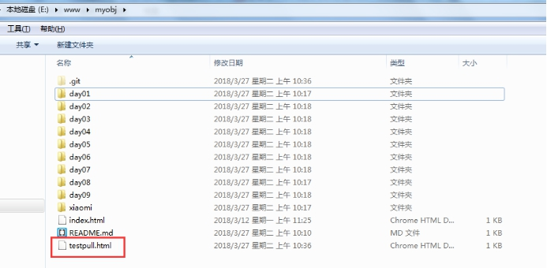

## 1、git简介

Git是什么？Git是目前世界上最先进的分布式版本控制系统（没有之一）。Git有什么特点？简单来说就是：高端大气上档次！那什么是版本控制系统？如果你用Microsoft Word写过长篇大论，那你一定有这样的经历：想删除一个段落，又怕将来想恢复找不回来怎么办？有办法，先把当前文件“另存为……”一个新的Word文件，再接着改，改到一定程度，再“另存为……”一个新文件，这样一直改下去，最后你的Word文档变成了这样：


过了一周，你想找回被删除的文字，但是已经记不清删除前保存在哪个文件里了，只好一个一个文件去找，真麻烦。

看着一堆乱七八糟的文件，想保留最新的一个，然后把其他的删掉，又怕哪天会用上，还不敢删，真郁闷。

更要命的是，有些部分需要你的财务同事帮助填写，于是你把文件Copy到U盘里给她（也可能通过Email发送一份给她），然后，你继续修改Word文件。一天后，同事再把Word文件传给你，此时，你必须想想，发给她之后到你收到她的文件期间，你作了哪些改动，得把你的改动和她的部分合并，真困难。

于是你想，如果有一个软件，不但能自动帮我记录每次文件的改动，还可以让同事协作编辑，这样就不用自己管理一堆类似的文件了，也不需要把文件传来传去。如果想查看某次改动，只需要在软件里瞄一眼就可以，岂不是很方便？


## 2、注册github

**官方网站**

<https://github.com/>

**注册账号和登录**

一、 打开官方网站；

 

二、 点击Sigin in进入登录页面；

 

三、 点击 [Create an account](https://github.com/join?source=login) 进入注册页面

 

四、 再次点击Sigin in进入登录页面，用你注册的账号或者邮箱进行登录；

五、 注册登录完成；

 

 

##  3、创建版本库

什么是版本库呢？版本库又名仓库，英文名**repository**，你可以简单理解成一个目录，这个目录里面的所有文件都可以被Git管理起来，每个文件的修改、删除，Git都能跟踪，以便任何时刻都可以追踪历史，或者在将来某个时刻可以“还原”。 

1.  登录后，点击+号下面的New repository；

 

2. 输入项目名称、项目描述，复选框勾选上，其他不用设置；

 

3.  点击 Create repository，项目仓库创建完成；

 

 

## 4、Git客户端安装

如果要进行Git的相关操作，需要安装个Git客户端；

1. 下载客户端安装软件：

   a) 下载： <https://git-scm.com/download/win> 

   b) 推荐国内下载地址：[https://pc.qq.com/search.html#!keyword=git](#!keyword=git)

    

   根据自己的操作系统选择下载32或64位版本；

2. 下载完成后双击安装，一路Next到底即可：

    

3.  客户端安装完成：

   任意目录—右键—点击“Git Bash Here”，输入git --version查看版本号；

    

		显示版本号表示安装成功；

##  5、配置SSH Key和账号、邮箱信息

我们选择使用SSH方式来管理代码，由于本地Git仓库和GitHub仓库之间的传输是通过SSH加密的，所以必须要让github仓库认证你SSH key，在此之前，必须要生成SSH key；

一、 任意位置右键—点击“Git Bash Here”，输入：

ssh-keygen -t rsa -C '1410475107@qq.com'

其中-t指定密钥类型，这里设置rsa即可，-c是密钥的注释，这里设置成邮箱方便分辨；

一路回车即可；

二、 把生成的keys配置到GitHub平台，配置位置参考下图：

a) 找到生成的key：在生成密钥时会告诉你生成的密钥保存路径，参考下图的红色框框；

 

b) 加入生成的key：使用编辑软件打开密钥文件，**不要自动换行**，然后复制密钥到下面的位置保存即可，如果在复制时有多余的空白行，最好删除；

 

 

点击“New SSH Key”；

​			

点“Add SSH Key”保存即可；

 

三、 配置用户名和邮箱：

a) git  config  --global  user.name  "github用户名"

b) git  config  --global  user.email  "邮箱"


## 6、代码的下载、上传和更新

#### 一、 下载项目到本地

需要注意的是这里不用创建项目目录名称，同步项目时目录会一起同步下来；

a) 找到项目的SSH地址并复制：

 

b) 在项目的本地保存位置右键—点击“Git Bash Here”，输入：git  clone https://github.com/wangling55555/web1.git

如有询问输入  yes；

 

此时本地是这样的：

 

#### 二、 本地代码提交到服务器：

a) 首先本地的项目目录下需要新增一些文件；

 

b) 然后你要进入到当前项目目录下：cd  myobj；

 

c) 追加要跟踪的文件：git  add .；点(.)表示全部追加进去，也可以指定具体的文件名；把文件添加到仓库： 

 

d) 使用commit把缓存区的代码更新到本地版本库中：用命令`git commit`告诉Git，把文件提交到仓库： 

git  commit  -m  '更新笔记'

其中-m是版本注释信息；

> 简单解释一下`git commit`命令，`-m`后面输入的是本次提交的说明，可以输入任意内容，当然最好是有意义的，这样你就能从历史记录里方便地找到改动记录 

e) 把本地代码推送到服务器的仓库里：

Git  push  origin  master

或者直接 git push也可以；

 

此时刷新服务器端版本库你会看到：

代码成功推送到服务器端；

#### 三、 更新服务器端最新代码到本地：git  pull

 

此时本地目录是这样的：



## 7、**多人协作管理项目**

一、 添加合作人：

 

选中用户后点“Add collaborator”按钮；

 

表示添加成功，对方的邮箱会收到验证邮件，等待对方接受；

 

二、 对方在邮件中点击“View invitation”按钮；

三、 进入网页后接受即可：

 

四、 接受后就是这个样子了：

 

账号853732886就可以提交代码到项目了；


## 8、**删除项目**

拉到最下面：

 

点击“Delete this repository”按钮；

 

在弹出窗口中把项目复制粘贴到输入框，剩下的你懂的；

## 9、**在线访问你的项目**

一、 创建gh-pages分支：

 

在输入框输入gh-pages，点击下面的Create branch:gh-pages

 

 

二、 下拉到：

 

你看到的，https://wangling55555.github.io/myobj1/index.html，访问该链接即可，此时默认首页是index.html，访问其他页面请输入文件名称；

## 10、git常用命令表

 


```bash
git status #查看所有文件状态
git log --oneline  根据更改信息来显示
git add .  提交新文件到暂存区

git commit -m '提示信息'
git push 提交到远程库
git pull  相当于是从远程获取最新版本
git reset --hard commit_id 回退版本

git checkout -- <file>     拉取暂存区文件 并将其替换成工作区文件
git reset HEAD -- <file>  本地版本库到暂存区
git diff	              工作区 vs 暂存区
git diff head	          工作区 vs 版本库
git diff --cached	      暂存区 vs 版本库
```


## 步骤

1.配置用户名和邮箱

2.git clone github项目地址

```
git  clone https://github.com/wangling55555/web1.git
```

3.往文件夹里面添加了一个inde.html

```
git status 查看状态 

git add 文件名  添加到暂存区
git add .      全部添加到暂存区

git commit -m '自己写的提示信息'
git reset hard commit版本id (git log获取版本id)

git pull拉取服务器的代码下来
git remote add origin https://github.com/wangling55555/tianmao.git
git push -u origin master  自己 第一次写的git 提交上去必须 
git push 后面就可以用git push
```

## 步骤

1、首页有index.html文件


2、在项目里面 git init

3.跟github建立连接

```
git remote add origin https://github.com/wangling55555/flower.git
```

4.正常提交

```
git add .
git commit -m '提示信息'
git push -u origin master 第一次提交
git push 后面修改提交
```


