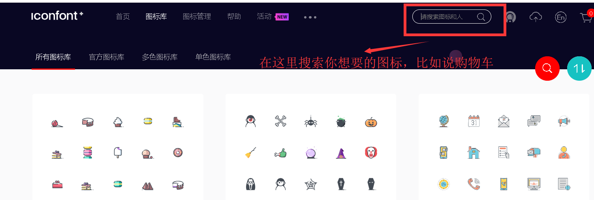
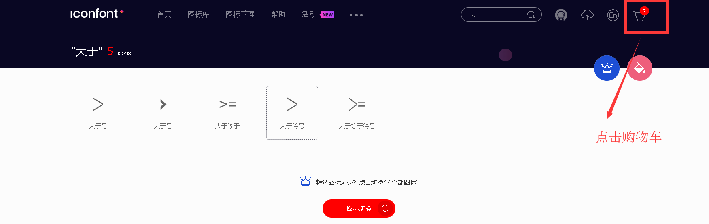
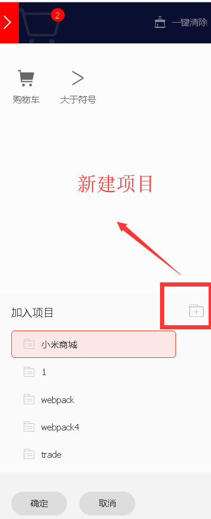
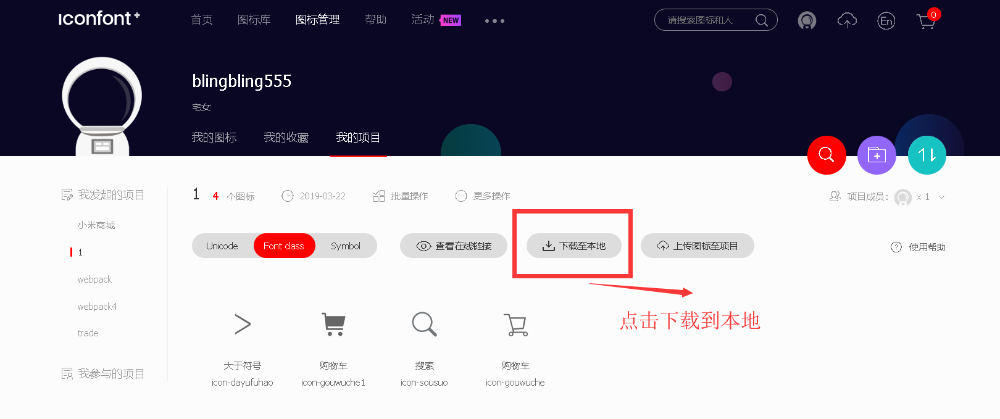
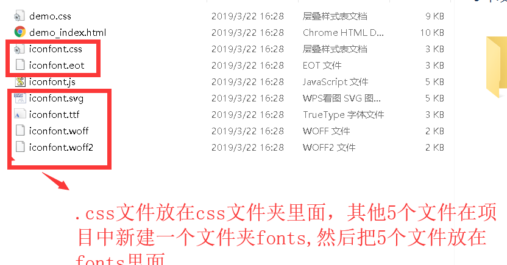
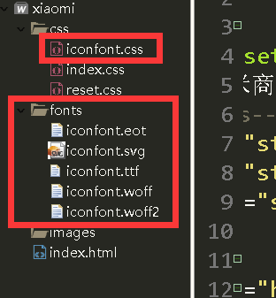
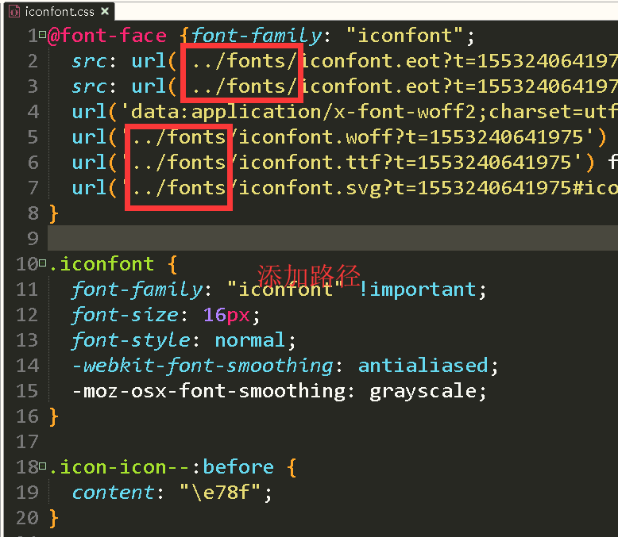
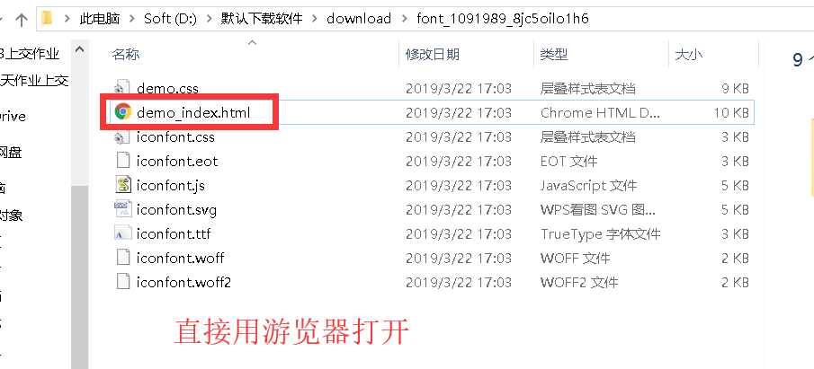
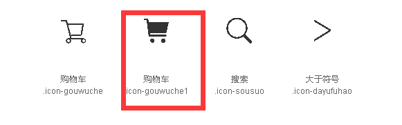

# iconfont的使用

> 注意：你先看下你页面上有哪些字体图标，最好一次下载，免得后面麻烦

1. 官网链接 https://www.iconfont.cn/

2. 点击所有图标库

   

3. 搜索，比如说 购物车

   

   4.  移到你想要的图标上，点击车车那个按钮

   

   5. 把你项目需要的字体图标都加在购物车里面，点击购物车



6.  把我们项目需要的图标添加到项目

   

7. 点击下载到本地，这时候你电脑就多了个文件夹，你先解压缩

   

   8. 把.css结尾的放在css文件夹里，把其他5个文件放在fonts文件夹里面

      

      



9. 然后更改iconfont.css的路径

   

10. 应用字体图标，先打开游览器，打开过后，会有使用方式

    

使用步骤如下：

### 第一步：引入项目下面生成的 fontclass 代码：

```
<link rel="stylesheet" href="./css/iconfont.css">
```

### 第二步：挑选相应图标并获取类名，应用于页面：

```
<span class="iconfont icon-xxx"></span>
```

比如说我要写购物车，前面的iconfont类名不能省略



```
<span class="iconfont icon-gouwuche1"></span>
```

